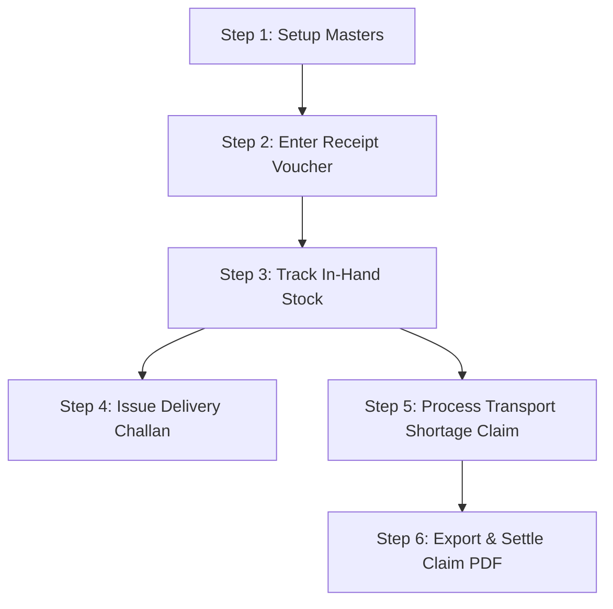

# Tea Stock Management System

> **Keyboard-First Desktop Inventory, Challan & Claim Management Solution for Local Tea Merchants**

[](https://electronjs.org)
[](https://reactjs.org)
[](https://sqlite.org)
[](https://typescriptlang.org)
[](https://github.com/sponsors/jaskirat91)

---

## 📋 Table of Contents

- [Overview](#-overview)
- [How It Helps Local Tea Merchants](#-how-it-helps-local-tea-merchants)
- [Key Features](#-key-features)
- [Step-by-Step Operating Workflow](#-step-by-step-operating-workflow)
- [Technology Stack](#-technology-stack)
- [Project Architecture](#-project-architecture)
- [Getting Started](#-getting-started)
- [Keyboard Shortcuts Reference](#-keyboard-shortcuts-reference)
- [Data Storage & Security](#-data-storage--security)
- [Support & Sponsorship](#-support--sponsorship)

---

## 🍃 Overview

The **Tea Stock Management System** is a dedicated, offline-first desktop application engineered specifically for **local tea merchants, brokers, wholesalers, and warehouse managers**. 

In the tea trade, inventory is non-standard and highly granular: tea arrives from various **gardens** in specific **grades** (e.g., BOP, OF, PD, BP) and distinct **lots**, packed into bags with varying gross and net weights. Furthermore, transit losses (shortages) between auction centers/gardens and local warehouses frequently lead to monetary disputes with transport agencies.

This application provides a single-window solution to **account for incoming tea stock**, **track lot-wise net weights**, **issue delivery challans (DOs)**, and **raise transport shortage claim reports**. Built with a **keyboard-first interface**, it allows merchants to perform lightning-fast entries without touching a mouse.

---

## ☕ How It Helps Local Tea Merchants

Local tea merchants face unique operational challenges that standard general accounting or generic inventory software cannot solve. Here is how this application directly addresses their daily needs:

### 1. Granular Tea Lot & Weight Accounting
* **Garden & Grade Tracking**: Categorizes incoming inventory down to the specific **Tea Garden** and **Grade**.
* **Bag vs. Weight Calculation**: Automatically calculates net lot weights based on `Bags Received × Weight Per Bag (WPB) - Shortage Weight`.
* **Multi-Firm Operations**: Manages inventory for multiple trading firms within a single unified workspace.

### 2. Delivery Challan (DO) Issuance
* **Automated Challan Generation**: Issues unique, sequential Delivery Orders / Delivery Challans (`FIRM/YEAR/NO`) for buyers and parties.
* **Real-time Stock Validation**: Displays live available bags and weights for selected garden lots during challan creation, preventing overselling or weight mismatches.

### 3. Transport Shortage & Claim Settlement
* **Transit Loss Record Keeping**: Records exact shortage weights reported upon goods arrival via Goods Receipts (GRs).
* **Claim Rate & Amount Calculation**: Allows merchants to set custom claim rates (₹/Kg) on shortage weights and automatically computes total claim amounts.
* **PDF Claim Statements for Transporters**: Generates formal, print-ready PDF claim reports detailing GR Numbers, transit dates, shortage quantities, and total claims for transport agency settlement.

### 4. High-Speed Data Entry for Daily Operations
* **Keyboard-First Navigation**: Full Alt-mnemonic keyboard support (`Alt+M` for Masters, `Alt+V` for Vouchers, `Alt+R` for Reports).
* **Smart Navigation Flow**: Pressing `Enter` automatically moves cursor focus to the next logically required field. Arrow keys allow rapid row-by-row navigation inside lot tables.
* **Inline Quick-Create**: Create missing Firms, Parties, Gardens, Grades, or Transports on-the-fly without exiting current voucher forms.

---

## ⚡ Key Features

| Feature | Description |
| :--- | :--- |
| **Receipt Vouchers** | Record incoming tea arrivals from suppliers/parties with multi-lot line items, transport details, freight amounts, GR numbers, and bill dates. |
| **Issue Vouchers & Challans** | Create dispatch delivery challans tied to specific incoming lots, deducting bags and net weight from live inventory. |
| **Stock Report & Filtering** | Comprehensive stock matrix filterable by Garden, Grade, Lot No, GR No, Transport, and Date Ranges. Supports CSV & PDF exports. |
| **Transport Claim Management** | Track shortages per transport, assign monetary claim rates (₹/Kg), and generate transporter-wise claim settlement PDFs. |
| **Visual Dashboard** | Financial Year stacked bar charts showing **Garden & Grade-wise In-hand Stock (Bags)** and **Transport-wise Shortage Stock (Kgs)**. |
| **Master Management** | Centralized management for **Firms**, **Gardens**, **Parties**, **Grades**, and **Transports** with active/inactive status toggles. |
| **Offline Privacy** | All business data is saved locally in an embedded SQLite database (`database.sqlite`). No internet connection required. |

---

## 🔄 Step-by-Step Operating Workflow

Follow this standard procedure to manage inventory, issue challans, and file shortage reports:



### Step 1: Setup Master Records
Navigate to **Masters** (`Alt+M`) to configure basic trade parameters:
1. **Firm Master** (`F`): Register trading firms with GSTIN, Code, and Phone.
2. **Garden Master** (`G`): Add tea gardens (e.g., *Halmari, Donyi Polo, Assam Gold*).
3. **Grade Master** (`A`): Add tea grades (e.g., *BOP, OF, PD, BP, Dust*).
4. **Party Master** (`P`): Register buying parties and suppliers with GSTIN.
5. **Transport Master** (`T`): Add goods transport agencies.

### Step 2: Record Incoming Tea Arrivals (Receipt Voucher)
Navigate to **Vouchers -> Receipt Voucher** (`Alt+V -> R`):
1. Select the destination **Firm** and supplier **Party**.
2. Enter transport details (**Transport**, **GR No**, **GR Date**, **Bill No**, **Freight Amount**).
3. Under **Lot Wise Entry**, add arrival lots:
   - Enter **Lot No**, select **Garden** and **Grade**.
   - Input **Total Bags** received, **Weight per Bag (WPB in Kg)**, and any initial **Shortage Weight**.
   - The system automatically calculates `Net Weight = (Bags × WPB) - Shortage Weight`.
4. Press `⌘S` (or `Ctrl+S`) to save the voucher.

### Step 3: Monitor Live Inventory & Reports
Navigate to **Reports -> Stock Report** (`Alt+R -> S`):
- View available bags and net weight for every lot.
- Filter by specific Garden, Grade, Transport, GR No, or Financial Year.
- Export data to **CSV** or print-ready **PDF**.

### Step 4: Issue Delivery Challan to Buyers (Issue Voucher)
Navigate to **Vouchers -> Issue Voucher** (`Alt+V -> I`):
1. Select **Firm** and **Party (Buyer)**.
2. The system automatically assigns the next sequential **Challan/DO Number** (`CODE/NO`).
3. Select the source **Garden** and **Grade** to filter available stock.
4. Pick the target **Lot Number**. The available bags and available weight will be displayed for reference.
5. Enter **No. of Bags**, **Weight per Bag**, **Price/Kg**, and **Issue Date**.
6. Save the voucher (`⌘S`). The stock is instantly deducted from available inventory.

### Step 5: Raise Shortage Reports & Transport Claims
When a transit loss is detected on a receipt lot:
1. Open **Reports -> Stock Report** (`Alt+R -> S`).
2. Locate lots where arrival weight was less than invoice weight (`Available Bags = 0` with remaining `Shortage Weight`).
3. Input the **Claim Rate** (₹/Kg) directly in the table line. The system automatically calculates `Claim Amount = Rate × Shortage Weight`.
4. Click **Generate Claim Report** button.
5. Select the **Firm**, **Transport Agency**, and date range.
6. The application generates a formatted **PDF Transport Claim Statement** displaying itemized GR numbers, arrival dates, shortage quantities, claim rates, and total claim amounts for transport settlement.

---

## 🛠 Technology Stack

* **Desktop Runtime**: [Electron 28](https://www.electronjs.org/)
* **Frontend Framework**: [React 18](https://reactjs.org/) with [TypeScript 5.3](https://www.typescriptlang.org/)
* **Bundler & Build Tool**: [Vite 5](https://vitejs.dev/)
* **Styling**: [TailwindCSS 3](https://tailwindcss.com/)
* **Database & ORM**: [SQLite3](https://www.sqlite.org/) managed via [TypeORM 0.3](https://typeorm.io/)
* **Data Visualization**: [Chart.js 4](https://www.chartjs.org/) with [react-chartjs-2](https://reactchartjs2.js.org/)
* **Document Exports**: [jsPDF](https://github.com/parallax/jsPDF), [jsPDF-AutoTable](https://github.com/simonbengtsson/jsPDF-AutoTable), [PapaParse](https://www.papaparse.com/)
* **Icons & UI Utilities**: [Lucide React](https://lucide.dev/), [Zustand](https://github.com/pmndrs/zustand) (State Management)

---

## 📁 Project Architecture

```
chaipatra_new/
├── app/
│   ├── main/                       # Electron Main Process & Backend Logic
│   │   ├── application/            # Application bootstrappers & window handlers
│   │   ├── domain/                 # TypeORM Data Entities
│   │   │   ├── AppSetting.ts       # Application configuration key-values
│   │   │   ├── Firm.ts             # Merchant Firm entities
│   │   │   ├── Garden.ts           # Tea Garden entities
│   │   │   ├── Grade.ts            # Tea Grade entities
│   │   │   ├── IssueVoucher.ts     # Delivery Challan / Issue entities
│   │   │   ├── Party.ts            # Supplier / Buyer Party entities
│   │   │   ├── ReceiptVoucher.ts   # Inward Stock Receipt entities
│   │   │   ├── ReceiptVoucherLot.ts# Granular Lot details & shortage claim tracking
│   │   │   └── Transport.ts        # Transport Agency entities
│   │   ├── infrastructure/         # TypeORM Data Source & SQLite configuration
│   │   └── interfaces/ipc/         # IPC Handlers for database CRUD & reporting queries
│   ├── preload/                    # Electron Preload script (Context Bridge IPC)
│   └── renderer/                   # React Frontend App
│       ├── components/             # Reusable UI components (Modal, Select, Badges)
│       ├── hooks/                  # Custom React hooks (IPC, Keyboard Hotkeys)
│       ├── modules/                # Application views
│       │   ├── DashboardModule.tsx # Interactive charts & visual metrics
│       │   ├── masters/            # Master data management & quick-create modal
│       │   ├── reports/            # Stock & Shortage Claim report generator
│       │   └── vouchers/           # Receipt and Issue Voucher entry forms
│       ├── store/                  # Zustand global stores (Navigation, Theme, Dialogs)
│       └── App.tsx                 # Main UI layout & mnemonic menu system
├── database.sqlite                 # Embedded local SQLite database
├── package.json                    # Dependencies & build scripts
├── vite.config.ts                  # Vite configuration
└── tsconfig.json                   # TypeScript configuration
```

---

## 🚀 Getting Started

### Prerequisites

- **Node.js**: `v18.x` or higher
- **npm**: `v9.x` or higher

### Installation

1. **Clone the Repository**
   ```bash
   git clone https://github.com/jaskirat91/tea-stock-management.git
   cd tea-stock-management
   ```

2. **Install Dependencies**
   ```bash
   npm install
   ```

3. **Start Development Environment**
   Runs Vite dev server and Electron simultaneously with hot-reloading:
   ```bash
   npm run dev
   ```

### Additional Scripts

- **Type Check**:
  ```bash
  npm run typecheck
  ```
- **Lint Code**:
  ```bash
  npm run lint
  ```
- **Format Code**:
  ```bash
  npm run format
  ```
- **Build Desktop Executables**:
  - macOS (`.dmg`): `npm run dist:mac`
  - Windows (`.exe` NSIS installer): `npm run dist:win`
  - Linux (`.AppImage` / `.deb`): `npm run dist:linux`

---

## ⌨️ Keyboard Shortcuts Reference

Designed for zero-mouse operations. Use the following shortcuts for maximum productivity:

### Top Navigation (Alt Mnemonics & Commands)
| Shortcut | Action |
| :--- | :--- |
| `Alt + D` | Jump to **Dashboard** |
| `Alt + M` | Open **Masters** menu (Follow with `F`: Firm, `G`: Garden, `P`: Party, `A`: Grade, `T`: Transport) |
| `Alt + V` | Open **Vouchers** menu (Follow with `R`: Receipt Voucher, `I`: Issue Voucher) |
| `Alt + R` | Open **Reports** menu (Follow with `S`: Stock Report) |
| `Cmd + 1..4` / `Ctrl + 1..4` | Switch top-level modules directly |
| `Cmd + T` / `Ctrl + T` | Toggle Dark / Light visual theme |

### Voucher Entry Form Shortcuts
| Shortcut | Action |
| :--- | :--- |
| `Enter` | Move focus to next form field |
| `Up Arrow` / `Down Arrow` | Move up/down between lot rows in table grid |
| `⌘ + Enter` / `Ctrl + Enter` | Add new lot line item to receipt voucher |
| `⌘ + Backspace` / `⌘ + Delete` | Delete highlighted lot row |
| `⌘ + S` / `Ctrl + S` | Save current voucher |
| `⌘ + B` / `Ctrl + B` | Cancel and go back to list view |

---

## 🔒 Data Storage & Security

- **100% Local & Private**: All business metrics, client lists, vouchers, and lot records are stored in a local SQLite file (`database.sqlite`) in the application root directory.
- **No Cloud Dependency**: The application functions entirely offline. Your commercial pricing and inventory figures never leave your machine.
- **Data Backups**: Simply back up or copy the `database.sqlite` file to a secure external drive or cloud drive to preserve your historical stock ledger.

---

## 💖 Support & Sponsorship

If **Tea Stock Management** is helping your tea merchant operations streamline inventory, issue delivery challans, or recover transport transit losses, consider supporting the ongoing development and maintenance!

<div align="center">

### Sponsor jaskirat91

<br />

<iframe src="https://github.com/sponsors/jaskirat91/button" title="Sponsor jaskirat91" height="32" width="114" style="border: 0; border-radius: 6px;"></iframe>

<br /><br />

<iframe src="https://github.com/sponsors/jaskirat91/card" title="Sponsor jaskirat91" height="225" width="600" style="border: 0;"></iframe>

</div>

---

## 📄 License

This software project is licensed under private commercial license. All rights reserved. Powered by **Supreme Software Solutions**.
